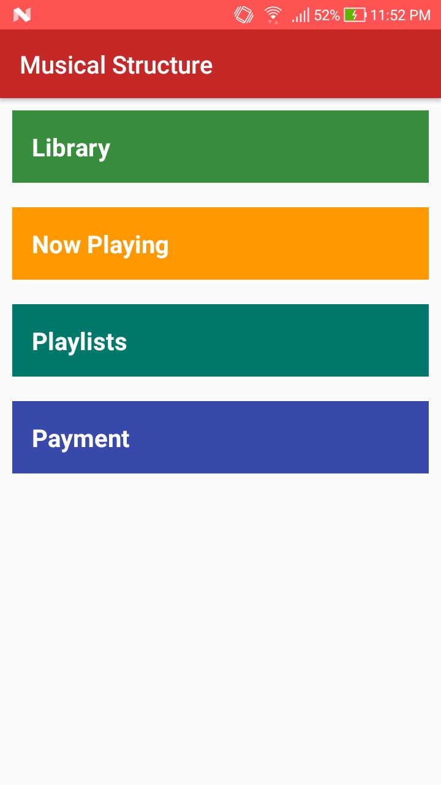
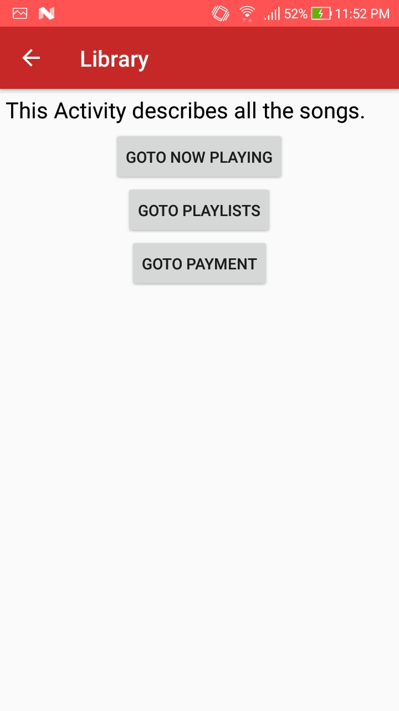
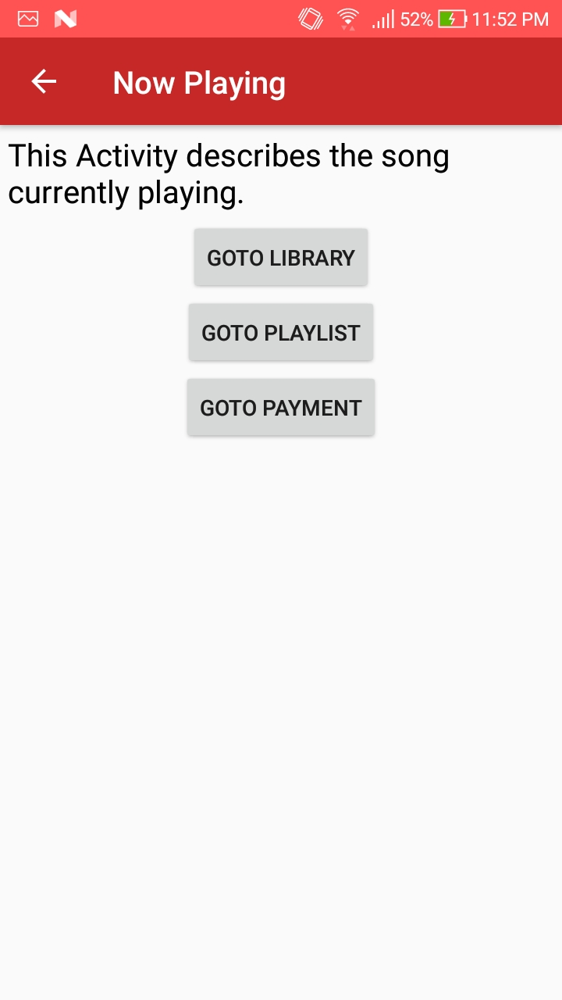
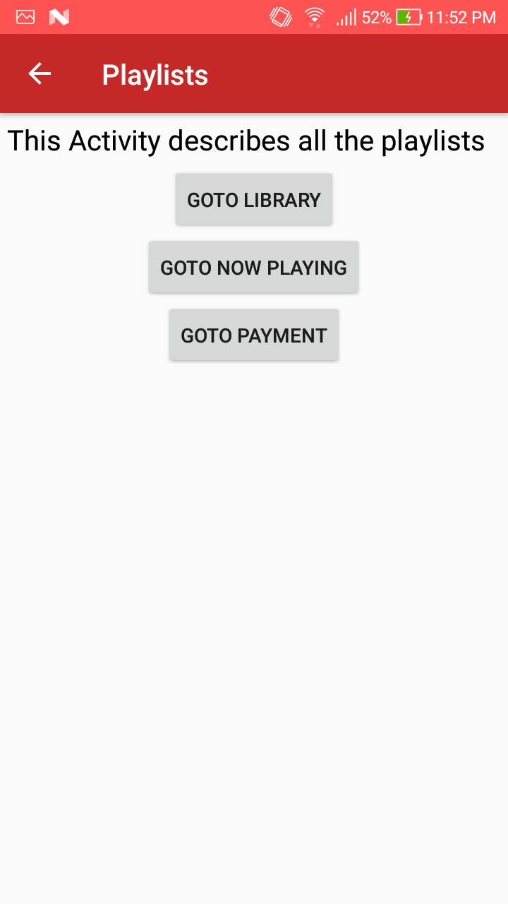
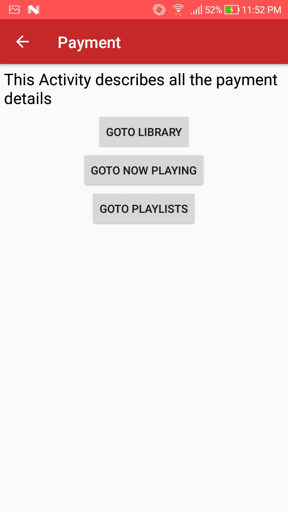

# Musical Structure App

This project was made as a part of Android Foundation  I Nanodegree Program. 
Features :
1. This is a Multi Screened App, the app’s structure is suitable for a music player app. 
2. Each activity is clearly labelled, using a TextView, such that the final purpose of such an activity is easy to understand. 
3. App also contains a Payment Activity. 
4. The code is properly formatted and is easily readable

The app video can be found at this [link](video.mp4) 

App contains 5 activities and the screenshots from the app are displayed below : 

